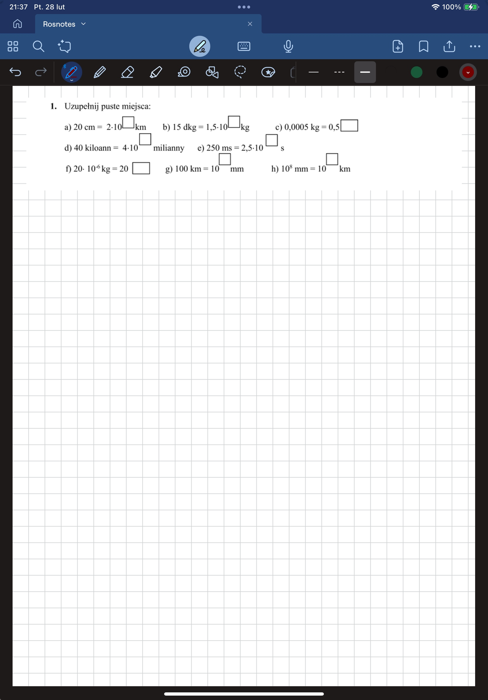
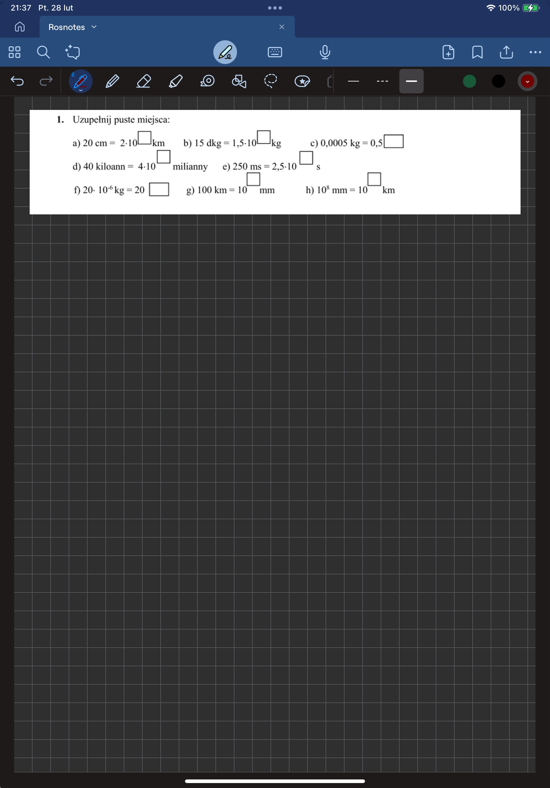
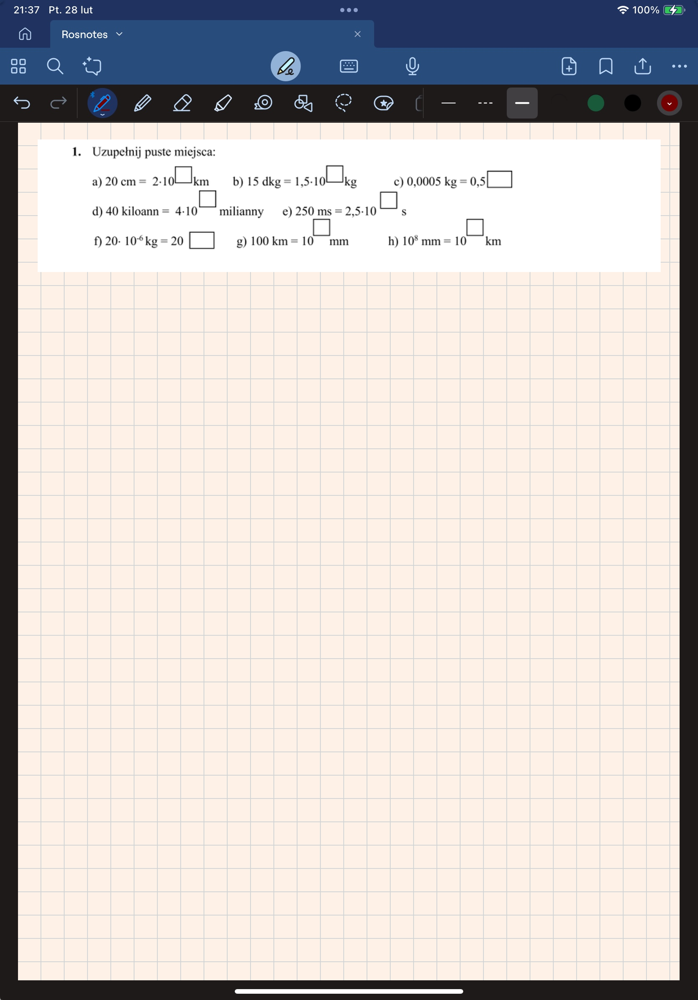

# Motywy

Kliknij nazwę motywu, aby pobrać.

### [White](../../../releases/download/Notebooks/Rosnotes-White.pdf)

  
  
  

### [Black](../../../releases/download/Notebooks/Rosnotes-Black.pdf)

  
  
  

### [Tangled](../../../releases/download/Notebooks/Rosnotes-Tangled.pdf)

  
  
  

### [Noxus](../../../releases/download/Notebooks/Rosnotes-Noxus.pdf)

  
  
  

## Motywy Encrypted
Hasła wymagane do odszyfrowania treści znajdują się w zeszytach publicznych (jeśli są wypełnione rozwiązaniami przez osobę, która zna hasła).

- [Encrypted 1](../../../releases/download/Notebooks/Rosnotes-Encrypted_I.pdf)
- [Encrypted 2](../../../releases/download/Notebooks/Rosnotes-Encrypted_II.pdf)
- [Encrypted 3](../../../releases/download/Notebooks/Rosnotes-Encrypted_III.pdf)
- [Encrypted 4](../../../releases/download/Notebooks/Rosnotes-Encrypted_IV.pdf)
- [Encrypted 5](../../../releases/download/Notebooks/Rosnotes-Encrypted_V.pdf)
- [Encrypted 6](../../../releases/download/Notebooks/Rosnotes-Encrypted_VI.pdf)
- [Encrypted 7](../../../releases/download/Notebooks/Rosnotes-Encrypted_VII.pdf)

> Hasła zawsze będą w języku angielskim lub, jeśli brak tłumaczenia, bez polskich znaków. Wpisywane są od spacji, małymi literami i jednocześnie oznaczają nazwę odblokowywanego motywu.
--- 

>  **Oświadczenie prawne**
> 
> Projekt Rosnote jest programem open-source'owym stworzonym w celu demonstracji możliwości personalizacji motywów. W ramach projektu zostały publicznie wykorzystane treści należące do:
> - Riot Games, w tym elementy związane z grą League of Legends, które są ich wyłączną własnością,
> - Walt Disney Company, w tym treści związane z ich filmami, które są ich wyłączną własnością.
>
> Projekt nie jest wspierany, sponsorowany ani powiązany w jakikolwiek sposób z Riot Games, Walt Disney Company ani żadnymi podmiotami powiązanymi. Wszelkie prawa autorskie oraz znaki towarowe pozostają własnością ich prawnych właścicieli. Projekt ma charakter edukacyjny i niekomercyjny.

  <a href="https://www.youtube.com/watch?v=b0Zu_EqJeUA&feature=youtu.be" target="_blank">
    <picture>
      <source srcset="../Organize/src/assets/logo_light.png" media="(prefers-color-scheme: light)">
      <source srcset="../Organize/src/assets/logo_dark.png" media="(prefers-color-scheme: dark)">
      
    </picture>

